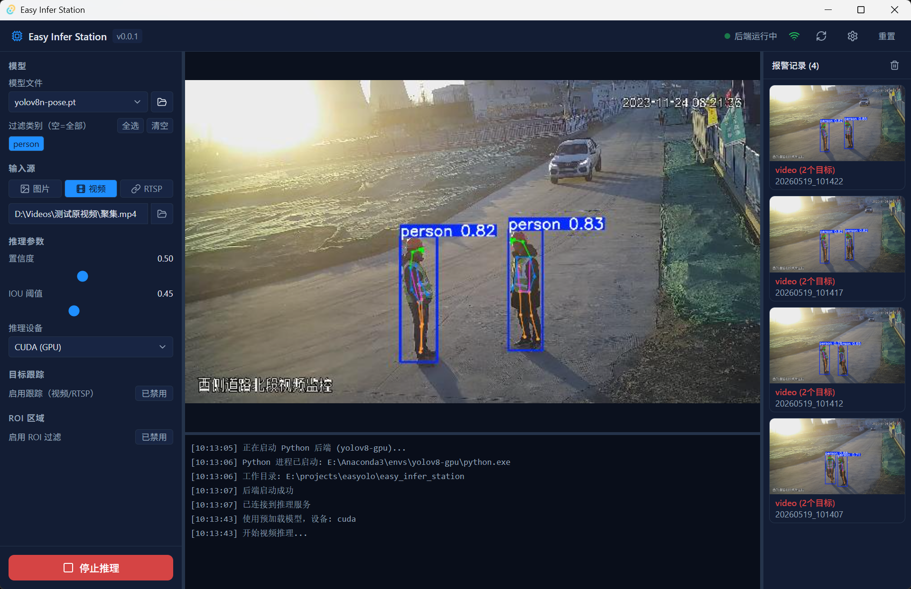

# Easy Infer Station

> 桌面端 YOLO 目标检测与姿态估计工具，支持单张/批量图片、视频文件及 RTSP 视频流实时推理。



**版本**：v0.0.4 · **协议**：AGPL-3.0 · **联系作者**：gawain@tsagent.cc

---

## 功能特性

- 🚀 **多输入源**：单张图片、批量图片、视频文件、RTSP 流
- 🖼️ **批量推理**：多图一次性选入，依次推理，结果以画廊形式展示
- 🔍 **画廊查看器**：点击图片进入全屏灯箱，支持缩放（滚轮/按钮）、拖拽平移、前进后退
- 🎯 **目标检测**：支持 YOLOv8 / YOLO11 系列及自定义 `.pt` 模型
- 🏃 **姿态检测**：支持 YOLO-Pose，含摔倒检测
- 🗂️ **自定义模型**：文件浏览器加载任意本地 `.pt` 文件，自动读取类别标签
- 📊 **实时推流**：Socket.IO 实时传输推理帧（RTSP / 视频模式）
- 🔧 **参数调节**：置信度阈值、IoU 阈值、标签过滤、推理设备（CPU / GPU）
- 📐 **ROI 区域**：画布交互式绘制感兴趣区域，支持取反报警
- 🚨 **报警截图**：RTSP 模式下自动截图保存报警帧
- 💪 **GPU 加速**：自动检测 CUDA，优先使用 GPU 推理
- 🔒 **安全**：后端只监听 127.0.0.1，CORS 限定本机 Tauri/Vite 来源

---

## 下载安装

前往 [Releases](https://github.com/MWang-TS/easy-infer-station/releases) 页面下载对应平台的安装包：

| 平台 | 安装包 |
|------|--------|
| Windows x64 | `Easy.Infer.Station_*_x64-setup.exe` |
| Windows ARM64 | `Easy.Infer.Station_*_arm64-setup.exe` |
| macOS Apple Silicon | `Easy.Infer.Station_*_aarch64.dmg` |
| macOS Intel | `Easy.Infer.Station_*_x64.dmg` |
| Linux x64 | `easy-infer-station_*_amd64.AppImage` / `.deb` |

下载后直接运行安装包完成安装。

> **macOS 用户**：首次打开若提示"无法验证开发者"，在"系统设置 → 隐私与安全性"中点击"仍然打开"，或在终端运行：
> ```bash
> xattr -rd com.apple.quarantine /Applications/Easy\ Infer\ Station.app
> ```

---

## 前置要求：Python 环境

Easy Infer Station 的推理引擎由 Python 驱动，**首次使用前必须配置好 Python 环境**，之后每次启动无需重复操作。

### 第一步：安装 Miniconda

| 系统 | 下载地址 |
|------|----------|
| Windows | [Miniconda3-latest-Windows-x86_64.exe](https://repo.anaconda.com/miniconda/Miniconda3-latest-Windows-x86_64.exe) |
| macOS Apple Silicon | [Miniconda3-latest-MacOSX-arm64.sh](https://repo.anaconda.com/miniconda/Miniconda3-latest-MacOSX-arm64.sh) |
| macOS Intel | [Miniconda3-latest-MacOSX-x86_64.sh](https://repo.anaconda.com/miniconda/Miniconda3-latest-MacOSX-x86_64.sh) |
| Linux x64 | [Miniconda3-latest-Linux-x86_64.sh](https://repo.anaconda.com/miniconda/Miniconda3-latest-Linux-x86_64.sh) |

**Windows**：双击 `.exe` 安装，完成后从开始菜单打开 **Anaconda Prompt**。

**macOS / Linux**：
```bash
bash Miniconda3-latest-*.sh
```

验证安装：
```bash
conda --version
```

### 第二步：创建专用 conda 环境

```bash
conda create -n yolo-infer python=3.10 -y
conda activate yolo-infer
```

### 第三步：安装依赖

激活 `(yolo-infer)` 环境后，根据是否有 NVIDIA 显卡选择对应命令：

#### 无 GPU（CPU 推理）

```bash
pip install flask flask-socketio flask-cors werkzeug \
    simple-websocket gevent gevent-websocket \
    ultralytics pillow pyyaml python-dotenv \
    opencv-python numpy torch torchvision
```

#### 有 NVIDIA 显卡（GPU 推理，推荐）

先安装 GPU 版 PyTorch（以 CUDA 12.1 为例，[查询你的 CUDA 版本](https://pytorch.org/get-started/locally/)）：

```bash
pip install torch torchvision --index-url https://download.pytorch.org/whl/cu121
```

再安装其余依赖：
```bash
pip install flask flask-socketio flask-cors werkzeug \
    simple-websocket gevent gevent-websocket \
    ultralytics pillow pyyaml python-dotenv \
    opencv-python numpy
```

验证安装：
```bash
python -c "import torch; print('PyTorch:', torch.__version__); print('CUDA 可用:', torch.cuda.is_available())"
python -c "from ultralytics import YOLO; print('ultralytics OK')"
```

> 若已有包含 PyTorch + ultralytics 的现有 conda 环境，可在首次启动时直接选择该环境，跳过以上步骤。

---

## 首次启动配置

1. 启动 Easy Infer Station，自动弹出**配置向导**
2. 点击"扫描环境"，等待扫描完成
3. 选择上一步创建的 `yolo-infer` 环境（绿色标记表示依赖完整）
4. 点击"确认"完成配置，应用自动启动推理后端

配置保存在本地，**之后启动无需重复设置**。

---

## 使用说明

### 基本流程

1. **选择模型**：从下拉列表选择内置模型，或点击 📂 加载本地 `.pt` 文件
2. **加载标签**：模型加载后自动读取类别标签，可勾选过滤
3. **选择输入源**：图片 / 批量图片 / 视频 / RTSP
4. **开始推理**：配置好参数后点击"开始推理"（批量模式下显示"批量推理 (N张)"）
5. **查看结果**：
   - 单张 / 视频 / RTSP：推理帧实时显示在预览区
   - 批量模式：推理完成后以画廊呈现，点击缩略图进入全屏查看器

### 批量推理

1. 选择输入源类型为"图片"
2. 点击**批量**按钮，多选图片文件
3. 点击"批量推理 (N张)"启动
4. 推理期间顶部进度条实时更新；完成后画廊自动填满
5. 点击任意图片进入**灯箱查看器**：
   - 滚轮缩放（以鼠标为缩放中心）
   - 点击拖拽平移
   - 工具栏按钮：适合窗口 / 原始大小 / 缩小 / 放大 / 前进 / 后退
   - 键盘快捷键：`←` / `→` 切图，`+` / `-` 缩放，`Esc` 关闭

### 推理参数说明

| 参数 | 说明 |
|------|------|
| 置信度阈值 | 过滤低置信度检测结果（建议 0.25～0.5） |
| IoU 阈值 | 非极大值抑制阈值 |
| 标签过滤 | 只显示勾选的目标类别 |
| 推理设备 | 选择 CPU 或 GPU（CUDA） |
| Pose 模式 | 启用人体关键点检测 |
| 摔倒检测 | Pose 模式下自动判断摔倒事件 |
| 追踪模式 | 启用 ByteTrack 目标持续追踪 |
| ROI 区域 | 在预览图上框选感兴趣区域 |
| 取反报警 | ROI 内**无目标**时触发报警（适合离岗检测） |
| 报警间隔 | 两次报警之间的最短间隔秒数 |

### 模型选择建议

| 场景 | 推荐模型 |
|------|----------|
| 速度优先（边缘设备 / CPU） | `yolov8n.pt` |
| 精度与速度均衡 | `yolov8m.pt` |
| 姿态估计 / 摔倒检测 | `yolov8n-pose.pt` |
| 高精度姿态 | `yolov8m-pose.pt` |
| 自定义业务场景 | 自行训练的 `.pt` 文件 |

---

## 常见问题

**Q：配置向导扫描不到任何环境？**  
确认已正确安装 Anaconda 或 Miniconda，且 `conda` 命令可在终端执行。Windows 用户需使用 Anaconda Prompt 安装或将 conda 加入 PATH。

**Q：环境显示"依赖不完整"（橙色标记）？**  
在该环境中执行"第三步：安装依赖"中的 `pip install` 命令补装缺失包。

**Q：如何确认是否在使用 GPU 推理？**  
推理日志中会显示 `device: cuda:0`（GPU）或 `device: cpu`（CPU）。

**Q：批量推理中途想停止怎么办？**  
点击"停止"按钮，后端收到信号后结束当前张处理并停止，已完成的结果仍保留在画廊中。

**Q：推理速度慢？**  
- 优先使用 GPU 版 PyTorch
- 选用较小模型（`yolov8n`）
- 降低视频分辨率或帧率
- 减少需要检测的目标类别

**Q：RTSP 流无法连接？**  
- 确认 URL 格式：`rtsp://用户名:密码@IP地址:554/流路径`
- 检查摄像头是否已开启 RTSP 功能
- 确认应用与摄像头之间网络可达（可先用 VLC 测试）

**Q：自定义模型加载失败？**  
确认模型为 Ultralytics YOLO 格式的 `.pt` 文件，且环境中 `ultralytics` 版本与训练时一致。

---

## 开源协议

本项目基于 **GNU Affero General Public License v3.0 (AGPL-3.0)** 发布。

本项目使用了以下开源库：

| 库 | 协议 | 用途 |
|----|------|------|
| [Ultralytics YOLO](https://github.com/ultralytics/ultralytics) | AGPL-3.0 | 目标检测 / 姿态估计推理引擎 |
| [Tauri](https://github.com/tauri-apps/tauri) | MIT / Apache-2.0 | 桌面应用框架 |
| [React](https://github.com/facebook/react) | MIT | 前端 UI 框架 |
| [Flask](https://github.com/pallets/flask) | BSD-3-Clause | Python 后端 Web 服务 |
| [Flask-SocketIO](https://github.com/miguelgrinberg/Flask-SocketIO) | MIT | Socket.IO 实时通信 |
| [OpenCV](https://github.com/opencv/opencv-python) | Apache-2.0 | 图像处理 |
| [PyTorch](https://github.com/pytorch/pytorch) | BSD-3-Clause | 深度学习框架 |

> 由于依赖 Ultralytics（AGPL-3.0），本项目整体须遵循 AGPL-3.0 协议。  
> 如需商业闭源使用，请参考 [Ultralytics 商业授权](https://www.ultralytics.com/license)。